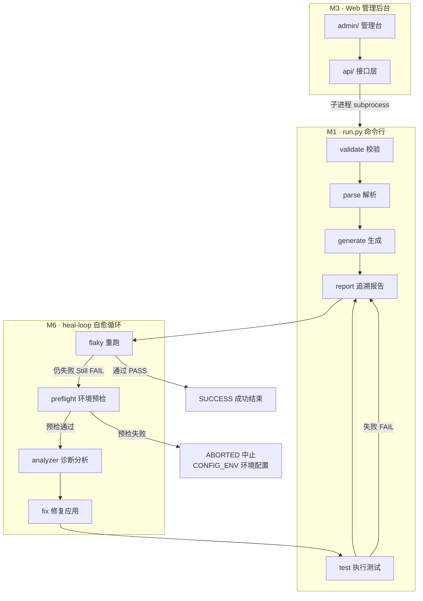
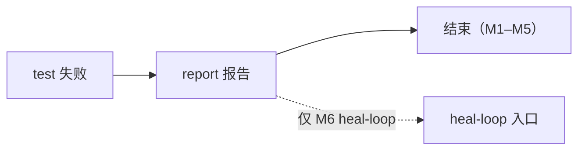

# 技术方案（TECH-DESIGN）

文档版本：4.4.1 | 日期：2026-06-15 | 模式：**spec-only**

> **职责**：架构、模块、数据契约、REST/CLI 接口、工程约束。  
> **验收 checkbox** → 仅 [PRD.md §8](./PRD.md)

---

## 1. 架构



> **图例**：`heal-loop 自愈循环` **仅 M6** 且须**显式执行** `python3 run.py heal-loop`；M1–M5 的 `test` 失败只更新追溯报告，**不**自动进入 flaky / preflight / analyzer。



### 1.1 CLI 命令语义

| 命令 | 步骤 | test | 报告 |
|------|------|------|------|
| `validate` | 格式校验 | — | — |
| `parse` | 单 PRD → JSON | — | — |
| `generate` | JSON → spec（按 `--prd-id`） | — | — |
| `report` | 刷新矩阵 | — | 见 §3.8 |
| `test` | Playwright + Vitest | 是 | 末尾自动 `report` |
| `generate-pipeline` | validate→parse→generate→report | 否 | M1 单文件 NOT_RUN；M2 skeleton |
| `run-full` | generate-pipeline + test | 是 | 正式 |
| `heal-loop` | 见 §8.2（**M6**） | 是 | 正式 + heal 审计 |
| `dev` | OpenHands 业务代码辅助（**M6**） | 否 | — |

> `dev` / `heal-loop` **M1–M5 不实现**；CLI 入口可预留，调用时 exit 1 并提示「M6 能力」。

**CI**：禁止用 `generate-pipeline` 代替 `test` 作 PR 门禁。

### 1.2 CLI 子命令

```bash
python3 run.py validate  --project <id> --prd <path>
python3 run.py parse     --project <id> --prd <path>
python3 run.py generate  --project <id> --prd-id <id> [--type e2e|component|all] [--force]  # --force: M2 本地
python3 run.py report    --project <id> [--layer e2e|component|all] [--prd-id <id>]
python3 run.py test      --project <id> [--layer e2e|component|all] [--prd-id <id>]
python3 run.py generate-pipeline --project <id> --prd <path> [--force]  # --force: M2
python3 run.py run-full  --project <id> --prd <path>
python3 run.py heal-loop --project <id> --prd-id <id>    # M6
python3 run.py dev       --project <id> --prd <path>     # M6
```

| 退出码 | 含义 |
|--------|------|
| 0 | 成功 |
| 1 | 通用失败 / `CONTENT_DRIFT`（M2·CI）/ `MERGE_CONFLICT`（M2）/ `AMBIGUOUS_COMPONENT_PATH` |
| 2 | 校验失败（`validate`） |

stderr 机器可读前缀：`CONTENT_DRIFT`、`MERGE_CONFLICT`、`VERSION_DRIFT`（警告）、`AMBIGUOUS_COMPONENT_PATH`。

---

## 2. 仓库结构（目标）

```
auto-dev-test/
├── docs/PRD.md, TECH-DESIGN.md
├── config/global.yaml, projects/*.yaml
├── templates/prd-template.md
├── prds/project-a/PROJ-001_login.md
├── design/SKILL.md
├── tests/fixtures/
│   ├── mock-e2e/              # M1 Playwright 静态站
│   ├── mock-frontend/         # M1 Vitest React 组件
│   └── test_data.json         # 占位符 → 字面量映射（generate 读取）
├── tests/{intermediate,generated,archive,msw}/
├── prd-parser/                # validator.py, parse.py, schema.py
├── test-generator/            # e2e 生成 + playwright.config.ts
├── component-generator/
├── run.py, report.py, config_loader.py
├── spec_idempotency.py        # M1
├── content_fingerprint.py     # M2
├── meta_db.py
├── vitest.config.ts, vitest.setup.ts
├── api/, admin/               # M3
├── heal/                      # M6
├── ci/                        # M5
└── archive/pre-docs-first/    # 历史参考，非规格
```

---

## 3. M1 — CLI 引擎

### 3.1 Fixture 与 `base_url`

**E2E（`tests/fixtures/mock-e2e/`）最小实现**

| 路径 | 要求 |
|------|------|
| `/login` | testid：`username-input`, `password-input`, `login-btn`, `error-message` |
| `/dashboard` | testid：`user-name`；正向登录后跳转 |
| `/health` | 返回 200（M6 preflight；M1 可选但建议实现） |

行为（M1 门禁用例）：

- `test@example.com` + `Test1234!` → 跳转 `/dashboard`，显示姓名  
- 错误密码 → 停留 `/login`，`error-message` 含「账号或密码错误」，密码框清空  

静态 HTML/JS 即可；`playwright.config.ts` 配置 `webServer` 端口 **4173**。

**组件（`tests/fixtures/mock-frontend/`）**

- `src/components/LoginForm.tsx`（与 `PROJ-001` `component_path` 一致）
- CTC-001：错误密码 → `error-message` 可见

**配置（normative 见 §11.1）**：`base_url: http://127.0.0.1:4173`，`vitest.frontend_root: ./tests/fixtures/mock-frontend`。

**M6**：`base_url` 可改 staging；`frontend_root` 可改 `repos.frontend`。

### 3.2 `validator.py`

规则（**覆盖** `global.yaml` 中 `required_sections` 的静态列表）：

1. Front Matter：`prd_id`, `version`, `project`（须与 `--project` 一致）
2. 必填：`功能名称`, `需求说明`, `验收标准`
3. **`页面交互` 与 `使用流程` 二选一**
4. 选 `页面交互` 时步骤 ≥ 2
5. 需求说明含「作为」「希望」「以便」
6. 验收标准：`- [ ]` 或 `- [x]`
7. `组件测试` 可选；有则校验块格式（`component` 必填）

### 3.3 `parse.py` → intermediate JSON

**路径**：`tests/intermediate/{project}/{prd_id}_test-cases.json`  
**Schema**：`prd-parser/schema.py`（Pydantic，M1 随引擎提交）

**根字段（M1）**

```json
{
  "prd_id": "PROJ-001",
  "prd_version": "1.0.0",
  "project": "project-a",
  "parsed_at": "2026-06-15T10:00:00Z",
  "feature_name": "用户登录",
  "e2e_test_cases": [],
  "component_test_cases": []
}
```

**M2 追加**：`prd_content_hash`, `source_git_sha?`

**`generate --prd-id` 解析**：读取 `{intermediate_dir}/{prd_id}_test-cases.json`；不存在则 exit 1。

**`component_path` 省略时**（`generate` 阶段解析，结果写入 intermediate 的 `component_path` 字段或 spec import）：

1. **约定路径**（按序，相对于 `vitest.frontend_root`）：
   - `src/components/{ComponentName}.tsx`
   - `src/components/{ComponentName}/index.tsx`
2. **未命中** → 在 `vitest.frontend_root` 下**深度优先**递归搜索 `{ComponentName}.tsx` / `{ComponentName}/index.tsx`（跳过 `node_modules`、`.git`、`dist`）
3. **0 个命中** → exit 1，提示补全 `component_path`
4. **≥2 个命中** → exit 1 **`AMBIGUOUS_COMPONENT_PATH`**，stderr 列出全部候选路径

**测试数据占位符**（两阶段契约）：

| 阶段 | 行为 |
|------|------|
| **`parse`** | intermediate JSON **保留** `{{valid.username}}` 等占位符，便于 diff 与追溯 |
| **`generate`** | 从 `tests/fixtures/test_data.json`（项目级可覆盖为 `tests/fixtures/{project}/test_data.json`）解析为**字面量**，写入 spec |

`test_data.json` 示例：

```json
{
  "valid": { "username": "test@example.com", "password": "Test1234!" },
  "invalid": { "password": "WrongPass!" }
}
```

生成的 spec **不得**含 `{{...}}` 或运行时占位符解析逻辑；敏感值不进 Git 时，generate 可读环境变量覆盖 `test_data.json`（仅本地，CI 用 committed json）。

**parse 策略**：Claude API（`ANTHROPIC_API_KEY`）；每条验收标准映射 0–N 用例。  
**`generate`（M1）**：**确定性模板**，不调用 LLM；读取 intermediate + `test_data.json` 输出 spec。

**用例 ID 与 M1 门禁**（`parse` 后处理，不依赖 LLM 自由发挥）：

1. **ETC**：按「验收标准」出现顺序编号，`ETC-001` = 第 1 条验收标准映射的首个 E2E 用例；无 E2E 映射则按 `页面交互` 正向路径生成并标为 `ETC-001`
2. **CTC**：按「组件测试」块顺序编号，`CTC-001` = 第 1 个组件用例
3. 门禁用例在 JSON 标 `m1_gate: true`（`ETC-001`、`CTC-001` 固定为 true）
4. LLM 返回的 id 若冲突，以**后处理重编号**为准

**M1 门禁**：**ETC-001**（正向登录）与 **CTC-001**（错误密码）须存在且 `m1_gate: true`；其余允许存在但报告标 `NOT_COVERED`。

**确定性 CI**：PRD 未变且 intermediate 已提交 → 可 `generate`（幂等 skip）+ `test`，无需 `parse`。

#### ETC 用例

```json
{
  "id": "ETC-001",
  "source_criterion": "验收标准原文",
  "title": "正向登录",
  "m1_gate": true,
  "steps": [
    {"action": "navigate", "target": "/login"},
    {"action": "fill", "testid": "username-input", "value": "{{valid.username}}"},
    {"action": "fill", "testid": "password-input", "value": "{{valid.password}}"},
    {"action": "click", "testid": "login-btn"}
  ],
  "assertions": [
    {"type": "url", "expected": "/dashboard"},
    {"type": "text_visible", "testid": "user-name"}
  ]
}
```

**ETC `action` 枚举**：`navigate`, `fill`, `click`, `clear`, `wait`

#### CTC 用例

```json
{
  "id": "CTC-001",
  "source_criterion": "...",
  "title": "错误密码提示",
  "m1_gate": true,
  "component": "LoginForm",
  "component_path": "src/components/LoginForm.tsx",
  "actions": [
    {"type": "fill", "testid": "username-input", "value": "{{valid.username}}"},
    {"type": "fill", "testid": "password-input", "value": "{{invalid.password}}"},
    {"type": "click", "testid": "login-btn"}
  ],
  "assertions": [
    {"type": "text_visible", "testid": "error-message", "text": "账号或密码错误"}
  ],
  "mocks": [
    {"method": "POST", "path": "/api/auth/login", "status": 401, "body": {"message": "账号或密码错误"}}
  ]
}
```

**CTC `action.type` 枚举**：`fill`, `click`, `change`, `clear`  
**断言 `type` 枚举**：`url`, `text_visible`, `not_visible`, `visible`, `hidden`, `disabled`, `enabled`

### 3.4 测试生成

**占位符替换**（`generate` 专属）：读取 `test_data.json`，将 intermediate 中所有 `{{a.b}}` 替换为字面量后再渲染模板。

**E2E** — `tests/generated/{project}/e2e/{prd_id}_*.spec.ts`

- 文件头：`// PRD: PROJ-001 v1.0.0 (project-a)`；M2 加 `// Hash: …`
- `page.getByTestId()` only；`BasePage` / `AuthHelper`
- 示例：`fillByTestId('username-input', 'test@example.com')`（硬编码，非 `{{...}}`）

**组件** — `tests/generated/{project}/component/{prd_id}_*.test.tsx`

- `tests/msw/server.ts`：`setupServer()` **无默认 handlers**
- 涉 API 的 **`it()` 块内** `server.use(...)`；**禁止**在 `describe` 顶层或 `beforeAll` 挂用例级 handler
- `vitest.setup.ts` 统一 `afterEach(() => server.resetHandlers())`
- `screen.getByTestId()` only

### 3.5 BasePage / AuthHelper

| BasePage | 说明 |
|----------|------|
| `navigate(path)` | `page.goto(base_url + path)` |
| `fillByTestId(id, value)` | fill |
| `clickByTestId(id)` | click |
| `assertTextByTestId(id, text)` | toContainText |
| `assertVisibleByTestId(id)` | toBeVisible |
| `assertUrl(path)` | URL 含 path |
| `waitForTestId(id)` | waitFor |

| AuthHelper | M1 fixture | M6 staging |
|------------|------------|------------|
| `cookie` | **skip** | 表单登录 + storageState |
| `token` | **skip** | extraHTTPHeaders |
| `basic` | **skip** | HTTP Basic |

凭据：`{credentials_env}_USER` / `_PASS` 或 `{token_env}`。

### 3.6 M1 幂等（无 content hash）

1. 读 intermediate `prd_version`
2. 读 spec 头 `PRD: {id} v{version}`
3. 同 → skip generate；升 → archive + generate
4. `meta.db` 仅本地加速，非权威

### 3.7 测试结果文件

| 文件 | 路径 | 写入方 |
|------|------|--------|
| Playwright JSON | `reports/{project}/pw-results.json` | `test` e2e 阶段 |
| Vitest JSON | `reports/{project}/vitest-results.json` | `test` component 阶段 |
| Playwright HTML | `reports/{project}/playwright-report/` | 可选（`report.format` 含 html） |

JSON 结构（最小）：

```json
{
  "run_at": "ISO8601",
  "cases": [
    {"id": "ETC-001", "status": "passed", "duration_ms": 1200},
    {"id": "CTC-001", "status": "failed", "message": "..."}
  ]
}
```

### 3.8 追溯报告 `report.py`

**路径**：`reports/{project}/{prd_id}_traceability.txt`（M2 skeleton：`*.skeleton.txt`）

**格式示例**：

```text
# 追溯报告 · PROJ-001 v1.0.0 · 用户登录
生成时间: 2026-06-15T10:05:00Z
测试执行: 2026-06-15T10:06:00Z | 总体: PASS

## 覆盖率
验收标准: 5 | 已映射: 5 | 已执行: 2 | PASS: 2 | FAIL: 0 | 未覆盖: 3

## 明细
| # | 验收标准（摘要） | 用例 | 状态 | 备注 |
|---|----------------|------|------|------|
| 1 | 正确账号密码登录成功... | ETC-001 | PASS | M1 门禁 |
| 2 | 错误密码登录失败... | ETC-002 | NOT_COVERED | |
| 3 | 账号不存在... | — | NOT_COVERED | 未映射 |
| 4 | 连续5次锁定... | — | NOT_COVERED | |
| 5 | 空值按钮禁用... | CTC-002 | NOT_COVERED | |
|   | （组件）错误密码提示 | CTC-001 | PASS | M1 门禁 |
```

**状态枚举**：`NOT_RUN`（未跑 test）、`PASS`、`FAIL`、`NOT_COVERED`（未映射或未纳入当次 `--layer`）、`SKIP`（生成但未执行）

| 阶段 | 文件 | 总体状态 |
|------|------|----------|
| M1 generate-pipeline | `*_traceability.txt` | NOT_RUN |
| M1 test 后 | 同上 | PASS / FAIL |
| M2 generate-pipeline | `*.skeleton.txt` | NOT_RUN |
| M2 test 后 | `*_traceability.txt` | PASS / FAIL；删 skeleton |

主数据源：intermediate + 当次 `pw-results.json` / `vitest-results.json`。

### 3.9 Vitest + MSW

```typescript
// vitest.config.ts — M1
export default defineConfig({
  test: {
    poolOptions: { threads: { singleThread: true } },
    setupFiles: ['./vitest.setup.ts'],
    include: ['tests/generated/**/component/**/*.test.tsx'],
    alias: { '@': path.resolve(__dirname, process.env.VITEST_FRONTEND_ROOT || './tests/fixtures/mock-frontend/src') },
  },
});
```

**MSW 隔离契约**（M1 即遵守，为 M4 并行预埋）：

| 规则 | 说明 |
|------|------|
| 全局 server | `setupServer()` 无 handlers；仅 `listen` / `close` |
| 用例级 mock | **只在** `it('...', async () => { server.use(...); ... })` 内声明 |
| 禁止 | `describe` 顶层、`beforeAll` 内 `server.use`（会泄漏到其他 `it`） |
| 清理 | `afterEach(() => server.resetHandlers())` 在 `vitest.setup.ts` 统一执行 |
| M4 并行 | **必须** `pool: 'forks'` + `isolate: true`；**禁止** `pool: 'threads'` 多 worker |

生成模板（`component-generator`）须内置上述结构；Code Review 检查项：每个涉 API 的 `it` 自包含 mock。

```typescript
// vitest.config.ts — M4（替换 M1 的 threads 配置）
test: {
  pool: 'forks',
  poolOptions: { forks: { isolate: true } },
  maxWorkers: '50%',
}
```

- `msw@^2`；Node 环境使用 `setupServer`（非 browser `setupWorker`）

### 3.10 多项目隔离（M1）

`project-b` 仅需 yaml 可加载且路径互不串写。验收命令：

```bash
python3 -c "
from pathlib import Path
import yaml
for pid in ('project-a', 'project-b'):
    cfg = yaml.safe_load(open(f'config/projects/{pid}.yaml'))
    for k in ('intermediate_dir','test_output_dir','archive_dir'):
        assert pid in cfg[k], f'{pid}.{k} missing project id'
    Path(cfg['intermediate_dir']).mkdir(parents=True, exist_ok=True)
print('OK')
"
```

---

## 4. M2 — 协作幂等

### 4.1 `content_fingerprint.py`

```python
def prd_content_hash(prd_path: Path) -> str:
    """去 YAML front matter → 统一 LF → 行尾去空白 → SHA-256 hex"""
```

### 4.2 generate 判定

| hash | version | 行为 |
|------|---------|------|
| 同 | 同 | skip |
| 同 | 异 | skip + stderr `VERSION_DRIFT` 警告 |
| 异 | 同 | 见下方 **CONTENT_DRIFT 分级** |
| 异 | 升 | archive + generate |

**CONTENT_DRIFT 分级**（hash 变、version 不变）：

| 环境 | 默认行为 |
|------|----------|
| **CI**（`CI=true`） | exit 1 `CONTENT_DRIFT`，阻断合并 |
| **本地** | stderr 警告 `CONTENT_DRIFT`，**允许** archive + generate 继续（便于 PRD 草稿迭代） |
| **任意** + `--force` | 显式 archive + generate，不 exit 1 |

> 本地默认宽松、CI 严格：避免「改一个字就必须 bump version」的调试摩擦，同时保证入库版本与 hash 一致。

`generate` / `generate-pipeline` 均支持 `--force`（M2）。

### 4.3 合并冲突扫描

**`parse` 与 `generate` 入口**均执行：

```python
CONFLICT_MARKERS = ("<<<<<<<", ">>>>>>>")
```

扫描：源 PRD、对应 intermediate、已存在 spec 文件头 2KB。命中 → exit 1 `MERGE_CONFLICT`。

> 不匹配单独一行 `=======`，降低误报。

### 4.4 归档

`tests/archive/{project}/{prd_id}_v{old_ver}_{layer}_{YYYYMMDDHHMMSS}{ext}`

---

## 5. M3 — Web 平台

### 5.1 选型

React 18 + Vite + FastAPI + SQLite `tests/generated/jobs.db` + Worker 并发 2（`API_MAX_WORKERS`）。

### 5.2 路由

| 路由 | M3 | M5 |
|------|----|----|
| `/` | 仪表盘 | |
| `/projects/:id` | PRD + 流水线 + 报告 | |
| `/projects/:id/prds/:file` | 只读 | 编辑 |

**testid（M3）**：`project-list`, `dashboard-summary`, `pipeline-generate-btn`, `pipeline-test-btn`, `pipeline-run-full-btn`, `pipeline-log`, `report-traceability`  
**testid（M6 增）**：`heal-analyze-btn`, `heal-loop-btn`, `heal-diff-preview`, `heal-apply-btn`, `heal-discard-btn`

### 5.3 REST API

#### 项目

```
GET  /api/projects
→ 200 [{ "id": "project-a", "name": "项目A", "base_url": "..." }]

GET  /api/projects/{id}
→ 200 { 公开 yaml 字段，无 secrets }

PUT  /api/projects/{id}                    # M5
← { "content": "yaml 文本" }
→ 200 | 400 { "detail": "..." }
```

#### PRD

```
GET  /api/projects/{id}/prds
→ 200 [{ "filename", "prd_id", "version" }]

GET  /api/projects/{id}/prds/{filename}
→ 200 { "content": "..." }

PUT  /api/projects/{id}/prds/{filename}     # M5
← { "content": "..." }
POST /api/projects/{id}/prds/upload         # M5
← multipart file
```

#### 流水线（202 异步入队）

```
POST /api/pipeline/validate
← { "project_id": "project-a", "prd": "prds/project-a/PROJ-001_login.md" }

POST /api/pipeline/parse
← { "project_id": "project-a", "prd": "prds/project-a/PROJ-001_login.md" }

POST /api/pipeline/generate
← { "project_id": "project-a", "prd_id": "PROJ-001", "type": "e2e|component|all" }

POST /api/pipeline/generate-pipeline
← { "project_id": "project-a", "prd": "prds/project-a/PROJ-001_login.md" }

POST /api/pipeline/run-full
← { "project_id": "project-a", "prd": "prds/project-a/PROJ-001_login.md" }

POST /api/pipeline/test
← { "project_id": "project-a", "layer": "e2e|component|all", "prd_id"?: "PROJ-001" }

POST /api/pipeline/report
← { "project_id": "project-a", "layer": "e2e|component|all", "prd_id"?: "PROJ-001" }

→ 202 { "job_id": "uuid" }
```

```
GET /api/pipeline/jobs/{job_id}
→ 200 {
  "id", "project_id", "command", "status",
  "exit_code", "created_at", "started_at", "finished_at",
  "log_tail": "string, max 8KB"
}
```

`status`: `PENDING | RUNNING | SUCCESS | FAILED | CANCELLED`

错误：`400` 参数非法；`404` 项目/PRD 不存在。

#### 报告

```
GET /api/reports/{project_id}
→ 200 [{ "prd_id", "kind": "final|skeleton", "updated_at" }]

GET /api/reports/{project_id}/{prd_id}/traceability
→ 200 { "content": "...", "kind": "final|skeleton" }
```

M1：仅 `final`。M2 起：优先 `final`，无则 `skeleton`。

### 5.4 `job_runner.py`

子进程 `python3 run.py ...`；日志 `logs/{job_id}.log`；`start_new_session=True`；shutdown SIGTERM→SIGKILL；`recover_stale_running_jobs()`。

### 5.5 路径安全

```python
path = (prd_dir / filename).resolve(strict=True)
assert path.is_relative_to(prd_dir.resolve())
assert not path.is_symlink()
```

上传 ≤1MB，仅 `.md`。

---

## 6. M4 — Vitest 并行

见 §3.9。**硬性要求**：`pool: 'forks'`，不得使用多 worker 的 `threads`（共享内存会导致 MSW handler 串扰）。

验收：pass/fail 集合与 M1 单线程 baseline 一致；并行压测下无随机失败。

---

## 7. M5 — CI

```yaml
on:
  pull_request:
    paths:
      - 'prds/**'
      - 'tests/intermediate/**'
      - 'tests/generated/**'
      - 'tests/fixtures/**'
      - 'config/projects/**'

jobs:
  generate:
    if: contains(github.event.pull_request.changed_files, 'prds/') || contains(..., 'intermediate/')
    run: python3 run.py generate-pipeline --project project-a --prd prds/project-a/PROJ-001_login.md

  test:
    run: python3 run.py test --project project-a --layer all
```

- 不 cache `meta.db` / `jobs.db`
- commit 生成物：`chore: regenerate tests [skip ci]`

---

## 8. M6 — dev + heal

### 8.1 `run.py dev`

OpenHands + `repos` + PRD + `typeui.skill_path`；不修改 `tests/generated/` 幂等逻辑。

### 8.2 heal-loop 时序

```
test → 失败
  → report
  → flaky 判定（§8.3）→ 是：原样重跑 test 一次 → PASS 则 SUCCESS 结束
  → preflight（§8.4）→ 失败：ABORTED, abort_reason=CONFIG_ENV
  → analyze（LLM）
  → 含 PRD_DRIFT（需求与实现不一致）→ ABORTED, abort_reason=PRD_DRIFT；仅 dry-run diff
  → fix + apply（test_script | business_code）
  → test → iteration < max_iterations 且未熔断则继续
```

### 8.3 flaky 判定（无 LLM）

满足**任一**即 flaky 候选，先原样重跑 `test` 一次：

- 报错含 `Timeout`, `ETIMEDOUT`, `ECONNRESET`, `ENOTFOUND`, `net::ERR_`
- 上一轮 PASS、同 commit 无变更仅本次 FAIL（可选 git diff）
- preflight 探活 `base_url` 不可达

重跑仍失败 → `ABORTED`, `abort_reason=FLAKY_EXHAUSTED`，**不**进入 analyze。

### 8.4 preflight

| 检查 | 配置 |
|------|------|
| HTTP | `GET {base_url}{health_check_url}`，默认 `/health`，404 时回退 `GET {base_url}/` |
| cookie | 试登录或 storageState |
| token | 带 Bearer 探活 |

### 8.5 熔断（`config/global.yaml` → `heal`）

```yaml
heal:
  max_iterations: 3
  wall_clock_sec: 900
  token_limit_per_run: 50000
  max_tokens_per_prd_24h: 200000
```

`heal_runs.token_cost` 实时累加；超限 `ABORTED`, `abort_reason=TOKEN_LIMIT`。

**`heal_runs.status`**：`RUNNING | SUCCESS | FAILED | ABORTED`  
**`abort_reason`**：`CONFIG_ENV | FLAKY_EXHAUSTED | TOKEN_LIMIT | PRD_DRIFT | WALL_CLOCK | MAX_ITERATIONS`

### 8.6 fix 白名单

| target | 可写 |
|--------|------|
| test_script | `tests/generated/{project}/` |
| business_code | `repos.*` 解析后路径内 |
| prd_drift（诊断分类） | 仅 `heal/fix-runs/{id}/` diff，不写 PRD；中止时 `abort_reason=PRD_DRIFT` |
| config_env | 不写 |

AST 审计（默认）：仅允许改测试文件、JSX 补 testid；禁止改核心业务分支。

### 8.7 heal API

```
POST /api/heal/analyze   ← { "project_id", "prd_id", "job_id"?: "uuid" }
POST /api/heal/fix       ← { "heal_run_id", "dry_run": true }
POST /api/heal/loop      ← { "project_id", "prd_id" }
GET  /api/heal/runs/{id}
POST /api/heal/runs/{id}/apply ← { "commit": false }
```

---

## 9. 数据模型

### 9.1 `meta.db` — `tests/generated/{project_id}/meta.db`（gitignore）

```sql
CREATE TABLE generated_specs (
  project_id TEXT, prd_id TEXT, prd_version TEXT, layer TEXT,
  spec_file TEXT, generated_at TEXT,
  PRIMARY KEY (project_id, prd_id, layer)
);
CREATE TABLE archived_specs (
  id INTEGER PRIMARY KEY AUTOINCREMENT,
  project_id TEXT, prd_id TEXT, prd_version TEXT, layer TEXT,
  archive_path TEXT, archived_at TEXT
);
```

### 9.2 `pipeline_jobs` + `heal_runs` — `tests/generated/jobs.db`（gitignore）

**单库**：`pipeline_jobs`（M3）与 `heal_runs`（M6）共用 `tests/generated/jobs.db`，不拆 `heal.db`。

```sql
CREATE TABLE pipeline_jobs (
  id TEXT PRIMARY KEY,
  project_id TEXT NOT NULL,
  command TEXT NOT NULL,
  args_json TEXT,
  status TEXT NOT NULL,
  created_at TEXT NOT NULL,
  started_at TEXT,
  finished_at TEXT,
  exit_code INTEGER,
  log_path TEXT
);
```

### 9.3 `heal_runs`（同库 `tests/generated/jobs.db`）

```sql
CREATE TABLE heal_runs (
  id TEXT PRIMARY KEY,
  project_id TEXT NOT NULL,
  prd_id TEXT NOT NULL,
  status TEXT NOT NULL,
  iteration INTEGER DEFAULT 0,
  max_iterations INTEGER DEFAULT 3,
  token_cost REAL DEFAULT 0,
  token_limit REAL,
  wall_clock_sec INTEGER DEFAULT 900,
  abort_reason TEXT,
  diagnosis_json TEXT,
  fix_plan_json TEXT,
  patch_dir TEXT,
  parent_job_id TEXT,
  created_at TEXT NOT NULL,
  finished_at TEXT
);
```

---

## 10. 技术选型

| 组件 | 选型 |
|------|------|
| E2E | Playwright TS ^1.45 |
| 组件 | Vitest ^2 + RTL ^14 |
| Mock | MSW ^2 |
| PRD parse | Claude API（M1 `parse`；M6 `heal` analyze） |
| PRD generate | 确定性模板（**无 LLM**，M1 起） |
| 元数据 | SQLite（本地） |
| 定位 | data-testid |
| 业务 Agent | OpenHands（M6） |
| Web | React 18 + Vite + FastAPI |

---

## 11. 配置契约（规范源）

> 仓库内 `config/**/*.yaml` **已与 §11 对齐**；变更须同步更新本节与 PRD。

### 11.1 `project-a.yaml`（M1）

```yaml
project_id: project-a
project_name: "项目A"

base_url: http://127.0.0.1:4173
health_check_url: /health

auth:
  type: cookie
  login_url: /login
  credentials_env: PROJECT_A_CREDENTIALS

prd_dir: ./prds/project-a/
intermediate_dir: ./tests/intermediate/project-a/
test_output_dir: ./tests/generated/project-a/
archive_dir: ./tests/archive/project-a/

playwright:
  browsers: [chromium]
  selector_strategy: data-testid
  web_server:
    command: "npx serve tests/fixtures/mock-e2e -l 4173"
    url: http://127.0.0.1:4173
  reuse_existing_server: auto   # loader 解析：非 CI → true，CI=true → false

report:
  format: text
  output_dir: ./reports/project-a/

vitest:
  enabled: true
  component_output_dir: ./tests/generated/project-a/component/
  frontend_src_alias: "@/"
  frontend_root: ./tests/fixtures/mock-frontend
  setup_file: ./vitest.setup.ts

typeui:
  skill_path: ./design/SKILL.md
  slug: clean

repos:
  frontend: ../acme-web
  backend: ../acme-api
```

### 11.2 `project-b.yaml`（M1 隔离）

```yaml
project_id: project-b
project_name: "项目B"

base_url: http://127.0.0.1:4174
prd_dir: ./prds/project-b/
intermediate_dir: ./tests/intermediate/project-b/
test_output_dir: ./tests/generated/project-b/
archive_dir: ./tests/archive/project-b/

report:
  format: text
  output_dir: ./reports/project-b/

vitest:
  enabled: false

auth:
  type: token
  token_env: PROJECT_B_TOKEN
```

M1 **不要求** project-b 有 PRD 或跑测试；仅验 yaml 加载与路径含 `project-b`。

### 11.3 `global.yaml`

```yaml
ai:
  provider: anthropic
  model: claude-sonnet-4-5
  max_tokens: 8096

prd_parser:
  retry_count: 3
  retry_delay: 2
  min_interaction_steps: 2

test_generator:
  idempotent: true
  auto_archive: true

heal:
  max_iterations: 3
  wall_clock_sec: 900
  token_limit_per_run: 50000
  max_tokens_per_prd_24h: 200000

metadata:
  meta_db_path: ./tests/generated/{project_id}/meta.db

typeui:
  skill_path: ./design/SKILL.md
  slug: clean
```

> `required_sections` **不**在 yaml 写死第四章节名；由 `validator.py` 实现「三章 + 交互二选一」。

### 11.4 `config_loader.py`（M1）

PyYAML **不**支持 Playwright JS 配置里的 `!process.env.CI` 自定义 Tag。约定：

1. yaml 布尔类环境相关字段用哨兵值 `auto` 或字符串 `"${VAR:-default}"`
2. `reuse_existing_server: auto` → loader 规则：**`CI` 未设或为假 → `true`（本地复用 serve）；`CI=true` → `false`**
3. 传给 `playwright.config.ts` 时写为 `reuseExistingServer: <bool>`

```python
def resolve_reuse_existing_server(value) -> bool:
    if value == "auto" or value is None:
        return os.getenv("CI", "").lower() not in ("true", "1", "yes")
    if isinstance(value, str) and value.startswith("${"):
        return resolve_env_placeholder(value)  # 通用 ${VAR:-default}
    return bool(value)
```

### 11.5 环境变量

| 变量 | 用途 | 里程碑 |
|------|------|--------|
| `ANTHROPIC_API_KEY` | `parse`（M1）；`heal` analyze（M6） | M1 parse |
| `{credentials_env}_USER/PASS` | cookie 鉴权 | M6 |
| `{token_env}` | bearer | M6 |
| `VITEST_FRONTEND_ROOT` | 覆盖 vitest 目标仓 | M1 |
| `API_MAX_WORKERS` | Web Worker 并发，默认 2 | M3 |

---

## 12. 工程约束

| 风险 | 对策 | 里程碑 |
|------|------|--------|
| M1 依赖外部 staging | fixture E2E + mock-frontend | M1 |
| 版本号 alone 不可靠 | `prd_content_hash` | M2 |
| merge 冲突 | parse + generate 扫描 | M2 |
| NOT_RUN 污染 | skeleton 分文件 | M2 |
| MSW 竞态 | M1 即 it 级隔离；M4 仅 forks 并行 | M1/M4 |
| 组件路径歧义 | 递归搜索 + `AMBIGUOUS_COMPONENT_PATH` | M1 |
| 本地 PRD 草稿迭代 | CONTENT_DRIFT 本地宽松 / CI 严格 | M2 |
| symlink 穿越 | `resolve(strict=True)` | M3 |
| 环境误 heal | preflight + flaky 规则 | M6 |
| Token 爆账单 | 双熔断 + heal_runs 审计 | M6 |

---

## 13. TypeUI

人工辅助；`design/SKILL.md` + MCP；设计稿不进 parse；testid 进 generate/heal。

---

## 14. M1 验收命令

```bash
export ANTHROPIC_API_KEY=...   # 仅 parse 需要

python3 run.py validate --project project-a --prd prds/project-a/PROJ-001_login.md
python3 run.py run-full --project project-a --prd prds/project-a/PROJ-001_login.md

# 期望产物：
# tests/intermediate/project-a/PROJ-001_test-cases.json
# tests/generated/project-a/e2e/PROJ-001_*.spec.ts
# tests/generated/project-a/component/PROJ-001_*.test.tsx
# reports/project-a/PROJ-001_traceability.txt（ETC-001、CTC-001 为 PASS）
```

产品 checkbox → [PRD.md §8 M1](./PRD.md)

---

## 15. 文档分工

| 内容 | 文档 |
|------|------|
| 用户故事、产品原则、验收 checkbox | **PRD** |
| CLI/API 契约、Schema、SQL、fixture、报告格式 | **TECH** |
| 里程碑依赖表 | **PRD §11** |
| 模块 ↔ 里程碑映射 | **§16** |

---

## 16. 模块 ↔ 里程碑

| 里程碑 | 模块 |
|--------|------|
| M1 | run.py, prd-parser, generators, report, fixtures, playwright/vitest 配置 |
| M2 | content_fingerprint, skeleton, conflict scan |
| M3 | api, admin, job_runner, path_safety |
| M4 | vitest 并行 |
| M5 | PUT 接口, ci/ |
| M6 | heal/, dev, repos 真实仓 |

```
M1 → M2 ─┬→ M3 → M5 → M6
         └→ M4
```

---

## 17. 依赖与运行时

**Python（M1）**：`anthropic`, `pyyaml`, `pydantic` ≥2  
**Node（M1）**：`@playwright/test`, `vitest`, `@testing-library/react`, `msw`, `serve`（fixture webServer）

根目录须有 `package.json` 脚本：

```json
{
  "scripts": {
    "test:e2e": "playwright test -c test-generator/playwright.config.ts",
    "test:component": "vitest run"
  }
}
```

Python 依赖：`requirements.txt` 或 `pyproject.toml`（M1 二选一，须可 `pip install`）。

---
